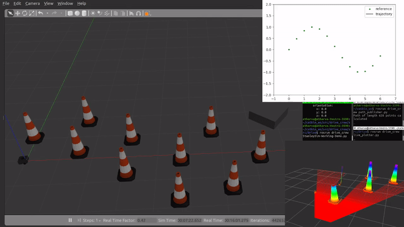

# Stanley controller

> The "Stanley" path tracking approach was used by Standford University's Darpa Grand Challenge 2005 team and the fastest course completion time.



The "Stanley" control approach tracks a ```reference point``` i.e. the closest point from its front axle on the reference trajectory. It uses a combination of lateral 'crosstrack' error as well as heading error to generate the steering control command for trajectory tracking.
The controller relies on a bicycle kinematic model.

The implementation is tested on multiple curved trajectories.

The source folder contains the following files:
1. stanley_control.py<br>
The controller file subscribes to the state of the robot and publishes control commands.
2. path_publisher.py<br>
A psuedo node that represents the system's planner, from which the controller will receive the reference trajectory.
3. live_plotter.py<br>
A node for visualization of the comparison between the reference trajectory and actual path travelled.

Result from live plotter node:


> *References* :<br>
[[1] Autonomous Automobile Trajectory Tracking for Off-Road Driving: Controller Design, Experimental Validation and Racing](https://ai.stanford.edu/~gabeh/papers/hoffmann_stanley_control07.pdf) <br>
[[2] Blog describing Stanley Control](https://dingyan89.medium.com/three-methods-of-vehicle-lateral-control-pure-pursuit-stanley-and-mpc-db8cc1d32081#:~:text=Stanley%20Controller&text=It%20is%20the%20path%20tracking,error%20and%20cross%2Dtrack%20error.)

> Date of completion: March 2022